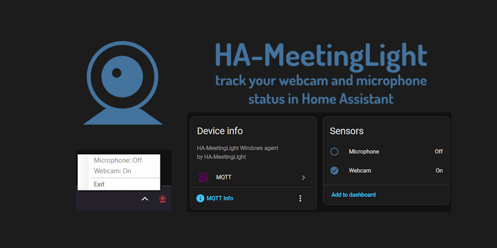

# HA-MeetingLight




A lightweight Windows system tray application that monitors webcam and microphone activity (e.g. during Teams/Zoom online meetings) and publishes status to Home Assistant via MQTT. 

You can then use a Home Assistant [automation](ha-automation-example.yaml), to turn your favourite status light on or off.

I use it to change color of LED light, to signal family if they can enter my home office.


## Features

- Monitoring of webcam and microphone activity
- MQTT integration for Home Assistant
- Minimal system resource usage
- Simple INI-based configuration
- No administrative premissions needed

## Requirements

- Windows 10+
- .NET 8 Runtime (optional)
- MQTT Broker (e.g., Mosquitto with Home Assistant)

## Installation

1. Download (or build) the application. You can use standalone version, if you don't on can't have .NET 8 runtime installed.
2. Copy the executable to your desired location
3. Edit `config.ini` file in the same directory (see Configuration below)
4. Run `HA-MeetingLight.exe`

## Configuration

Edit a `config.ini` file in the same directory as the application executable:

```ini
[MQTT]
Server=homeassistant.local
Port=1883
Username=mqtt_user
Password=mqtt_password

[Monitoring]
PollingIntervalSeconds=10

[Logging]
LogToFile=no
```

### Configuration Parameters

**[MQTT] Section:**
- `Server` (REQUIRED): MQTT broker IP address or hostname
- `Port` (OPTIONAL): MQTT broker port (default: 1883)
- `Username` (OPTIONAL): MQTT authentication username
- `Password` (OPTIONAL): MQTT authentication password

**[Monitoring] Section:**
- `PollingIntervalSeconds` (OPTIONAL): Device polling interval in seconds (default: 10, range: 1-60)

**[Logging] Section:**
- `LogToFile` (OPTIONAL): Log connections to info.log file (default: no)


## Usage

### System Tray Menu
- **Microphone: On/Off** - Shows current microphone status
- **Webcam: On/Off** - Shows current webcam status
- **Exit** - Closes the application

### MQTT Topics

The application publishes to the following topics:
- `HA-MeetingLight/{HOSTNAME}/webcam` - Webcam status ("on" or "off")
- `HA-MeetingLight/{HOSTNAME}/microphone` - Microphone status ("on" or "off")

Where `{HOSTNAME}` is your computer's hostname.

### Home Assistant Integration

Your MQTT broker in HomeAssistant should automatically create a device `{HOSTNAME}` with webcam and microphone binary sensors.


## Troubleshooting

### Application Won't Start

1. Ensure `config.ini` exists in the same directory as the executable
2. Verify MQTT server is accessible
3. Set LogToFile=yes in `config.ini`, to debug.

### Connection Issues

- Check MQTT broker is running and accessible
- Verify server address and port in `config.ini`
- Check username/password if authentication is enabled
- The application will retry connection every 60 seconds

### Device Detection Issues

- Ensure you're using applications that properly register device usage with Windows
- Check registry access at: `HKEY_CURRENT_USER\SOFTWARE\Microsoft\Windows\CurrentVersion\CapabilityAccessManager\ConsentStore`
- Modern UWP apps and most video conferencing software (Teams, Zoom, etc.) are supported

## How It Works

The application monitors Windows Registry entries that track device usage:
- `HKCU\SOFTWARE\Microsoft\Windows\CurrentVersion\CapabilityAccessManager\ConsentStore\webcam`
- `HKCU\SOFTWARE\Microsoft\Windows\CurrentVersion\CapabilityAccessManager\ConsentStore\microphone`

When an application uses your webcam or microphone, Windows updates these registry keys. HA-MeetingLight polls these keys at the configured interval and publishes changes to MQTT.

## License

GNU General Public License v3.0


## Support

Feel free to open a GitHub issue.
